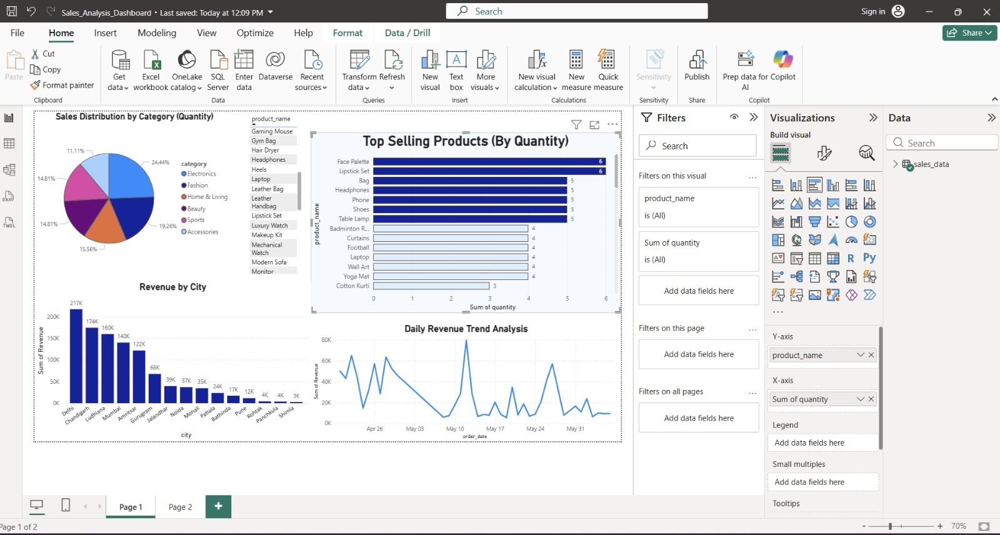
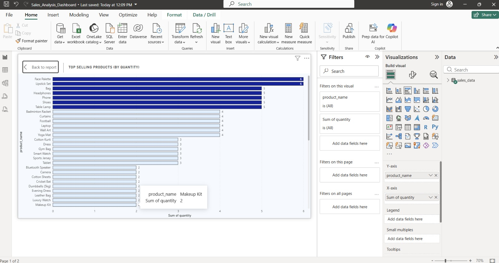
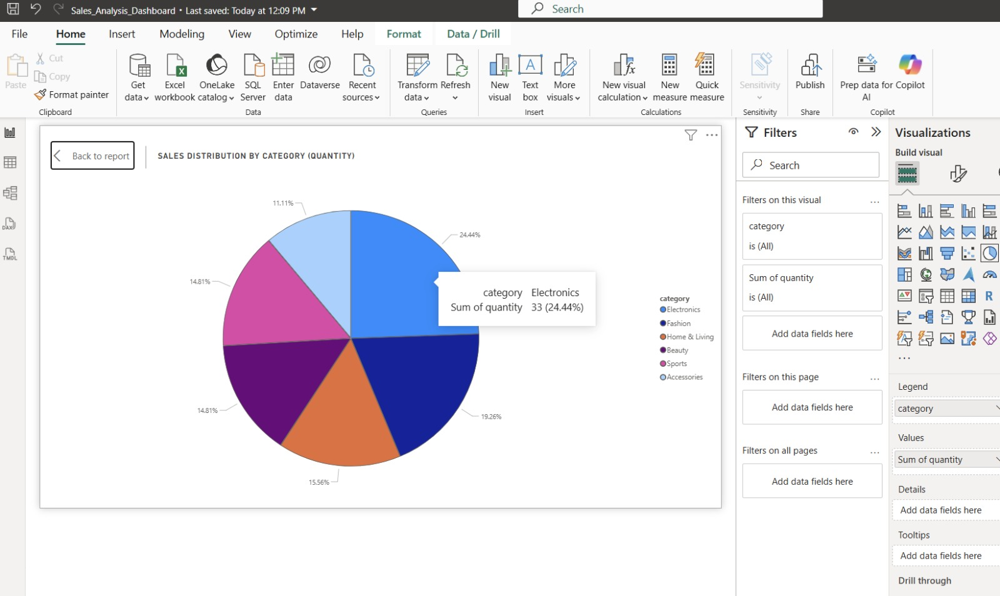
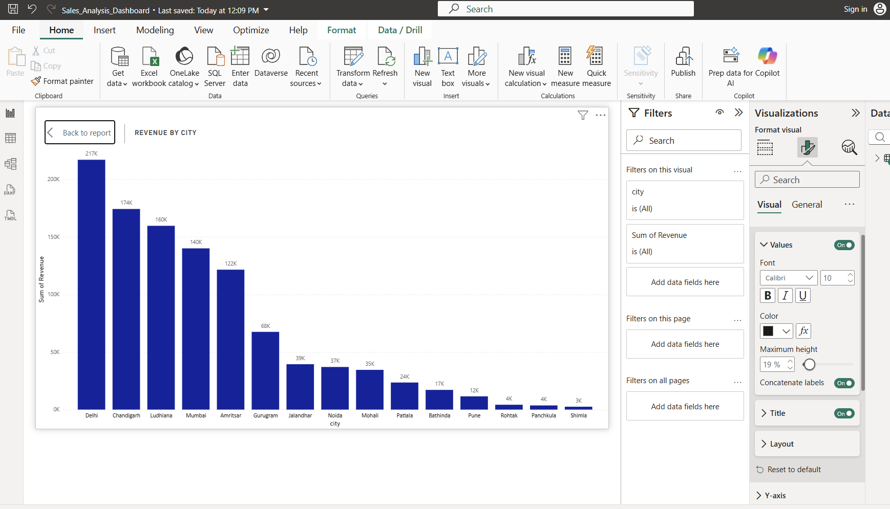
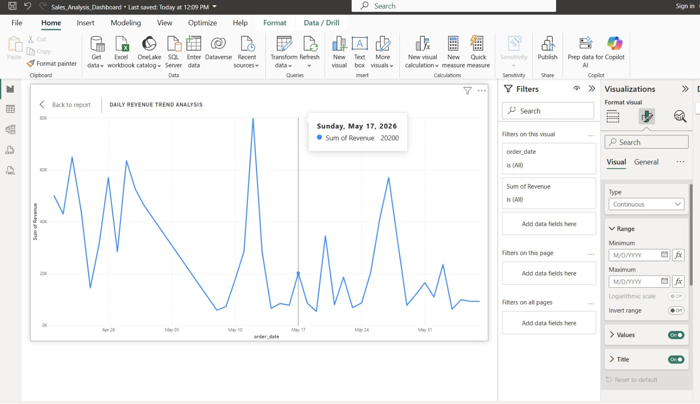

# 📊 Sales Analysis Dashboard

## 📌 Project Overview
This project analyzes sales data using MongoDB and Power BI to generate meaningful insights.

---

## 🛠 Technologies Used
- MongoDB (NoSQL Database)
- Power BI (Data Visualization)

---

## 📂 Dataset Fields
- Product Name
- Category
- Price
- Quantity
- City
- Order Date

---

## 🔍 Analysis Performed
- Top Selling Products
- Sales Distribution by Category
- Revenue by City
- Daily Revenue Trends

---

## 📁 Files Included
- sales_data.csv → Dataset
- Sales_Analysis_Dashboard.pbix → Power BI Dashboard
- mongodb_queries.txt → MongoDB Queries

---

## 📊 Dashboard Preview

---

## 🚀 Conclusion
This project helps in transforming raw data into meaningful insights.

---

## 👩‍💻 Author
Aditi Kaushal
